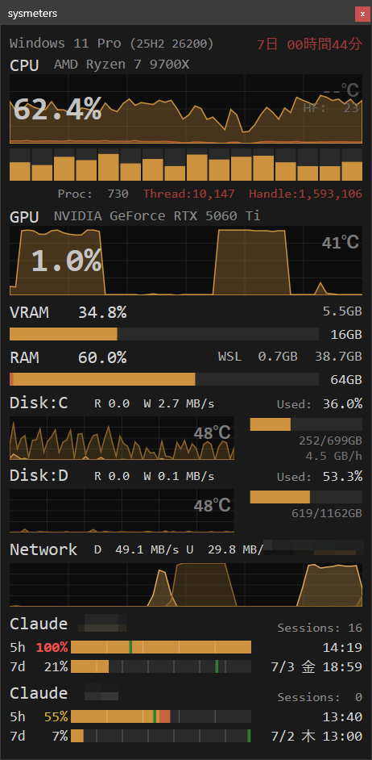
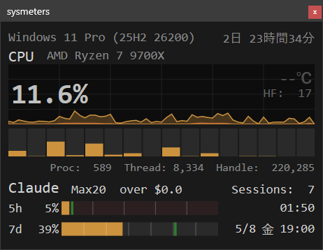
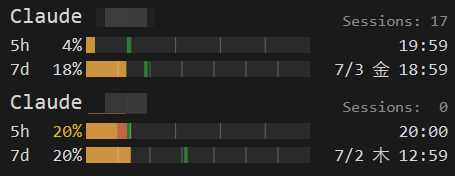
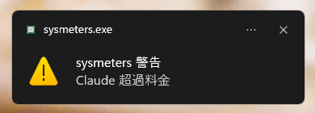

# sysmeters

[](README.md)
[](README.en.md)
[](https://github.com/aviscaerulea/sysmeters/releases/latest)
[](LICENSE)
[](https://github.com/aviscaerulea/sysmeters/actions/workflows/release.yml)

A real-time system resource monitoring HUD application for Windows 11.

In addition to CPU, GPU, memory, disk I/O, and network throughput,  
it monitors Claude Code rate limit usage in a compact overlay GUI.



From the "表示項目" (Display Items) submenu in the tray icon's right-click menu, each section — CPU, GPU, memory, disk, network, and Claude — can be toggled on and off individually, and disks can additionally be toggled per drive. This also lets you shrink the window by leaving only the categories you need. The figure below shows an example displaying only CPU and Claude.



When a sub account is enabled, the Claude section is displayed for both the main and sub accounts, stacked vertically. The figure below shows that display. The darker shading on the 5h / 7d bars indicates the usage increase over the last N minutes, visualizing the consumption pace.



A Toast notification appears the moment any warning threshold is exceeded. Notifications can be toggled on and off from the tray icon's right-click menu.



## Features

- CPU: Displays overall usage (area chart), hard faults, per-logical-core usage (vertical bars), temperature, and system statistics (Proc/Thread/Handle)
- GPU: Displays usage (area chart) and temperature, via NVIDIA NVML
- RAM: Displays usage (horizontal bar) and used/total
- VRAM: Displays usage (area chart) and used/total, via NVIDIA NVML
- Disk I/O: Automatically detects fixed drives and displays read/write throughput, usage, used/total, and S.M.A.R.T. write volume per drive
- Network: Displays aggregated send/receive throughput across all NICs, separated by direction
- IP: Displays the global IP address (shows NO INTERNET📵 when offline)
- OS: Displays the OS name and continuous uptime (turns to the warning color once uptime exceeds the threshold)
- Claude Code: Displays 5h / 7d rate limit usage, reset times, and session counts (main and sub accounts can be displayed simultaneously)
- Claude Code nudge: Detects the gap after a rate limit reset where consumption has not yet started, and automatically launches `claude.exe`
- Top process display: Shows the name and usage of the top process inside the CPU / GPU area charts
- Display item toggles: Turns each section — CPU, GPU, memory, disk, network, and Claude — on and off individually (disks can also be toggled per drive)
- Compact mode: Scales the entire display, including charts and fonts, down to 3/5
- Update check: Checks for the latest GitHub release at startup and announces new versions via Toast notification and the tray menu
- Alert sound: Plays `alert.wav` when a monitored item exceeds its warning threshold
- Toast notifications: Reports which item exceeded its threshold through the OS Toast notification system

Direct2D GPU-accelerated rendering delivers smooth display.

### Disk Display

Fixed drives present at startup (in drive-letter order from C:, up to 8 drives) are detected automatically. Virtual drives that present themselves as fixed drives, such as Google Drive, are excluded because no physical disk backs them. Display can be toggled per drive from "表示項目" (Display Items) in the tray menu; free space and S.M.A.R.T. warnings continue to be monitored even while a drive is hidden.

### Top Process Display

The name and usage of the top process are shown inside the CPU / GPU area charts in the form `chrome 28%`. Processes sharing an executable name (such as Chrome's multiple processes) are aggregated and displayed with the `.exe` suffix removed.

CPU figures are measured every 0.9 seconds from the increase in each process's used time, on a scale where the whole system is 100%. GPU figures are collected about every 2.7 seconds by aggregating rendering and compute engine usage per process and taking the maximum. While values are tied (the rounded integer percentages are equal), the previously displayed process is retained to suppress flicker between entries.

The display can be toggled with "トッププロセス表示" (Top Process Display) in the tray menu; collection itself stops while it is off. The setting is persisted in the registry so it survives restarts, and the default is on.

The display is hidden while load is not concentrated on any particular process. Once shown, the display is retained until values fall below 80% of each threshold. (to prevent flicker near the boundary) Even after the display conditions are lost, the last shown process name and usage are frozen and displayed faintly for a set duration, preventing momentary spikes from being missed. (afterimage display; it is immediately replaced with live values once the display conditions hold again)

### Claude Code Display

Displays 5h / 7d rate limit usage (horizontal bars), reset times, and session counts. Main and sub accounts can be displayed simultaneously, stacked vertically.

- The green vertical line on the horizontal bar is the even-pace marker (the ideal consumption position if usage were spread evenly over the time remaining until reset)
- To the right of the 5h bar (aligned with the month digits of the 7d reset timestamp) is the number of 5h turns remaining before the 7d reset, including the turn in progress
- The 5h / 7d bars overlay the usage increase over the last N minutes in a darker shade (the same color as the RAM WSL overlay) to visualize the consumption pace
- Directly below the 7d bar, a gray mini bar shows consumption of the dedicated 7d quota for higher-tier models such as Fable (only for accounts whose Usage API returns a dedicated quota)
- When the dedicated quota reaches 100%, the mini bar changes to the warning color and raises a per-account alert sound and Toast notification (reset once it falls back below 100%)
- The latest data is force-fetched at the top of every hour
- Session counts are determined from each `claude.exe` process's `CLAUDE_CONFIG_DIR` environment variable and tallied separately per account
- To the left of the Sessions label, the timestamp of the most recent Usage API fetch (`H:MM` format) is displayed in the same color and size, so data freshness can be confirmed
- While the Usage API cannot be fetched, `Err` is displayed in red to the right of the plan name
- While logged out (no OAuth token), `Logout` is displayed regardless of fetch success, and re-authentication via `claude login` is required

### Claude Code Nudge

A feature that automatically launches `claude.exe` at the moment it detects the gap after a 5h window reset where rate limit consumption has not yet started (including immediately after startup, once per window), encouraging consumption in the next window. Default is off.

Even while a Usage API fetch is failing (`Err` displayed), it fires on an estimate once the known 5h reset time has passed. (because whether a new window has begun cannot be confirmed; for an `Err` caused by expired credentials, launching `claude.exe` can heal the `Err` by refreshing the token)

The launch command is shared between both accounts. When run for the sub account, it is launched with the `CLAUDE_CONFIG_DIR` environment variable temporarily set to the sub account's configuration directory. (the Claude CLI has no `--config-dir` command option; overriding the configuration directory is only possible through the environment variable)

### Warning Colors

When a metric exceeds the threshold in the configuration file, the corresponding text or bar turns red. Temperatures are color-coded in three tiers (normal: gray → caution: orange → critical: red). Warning color decisions are based on instantaneous values.

### Alert Sound

When any monitored item exceeds its threshold, `alert.wav` is played. A hysteresis mechanism prevents the same item from sounding again until it falls below the reset threshold. Alert sounds for CPU, GPU, RAM, and VRAM are judged on an average of the most recent samples to prevent false alarms from momentary spikes.

- To address the problem of the beginning being cut off when BLE headphones enter power saving mode, a 19kHz inaudible tone is inserted before and after playback
- Playback uses WASAPI shared mode, so it coexists with audio from other applications

### Notification Suppression

While a fullscreen application (games, presentations, etc.) is running, Toast notifications and alert sounds are automatically suppressed.

- Suppression can be toggled with "フルスクリーン時は通知しない" (Do not notify in fullscreen) in the tray menu (default on)
- Warnings you want through during suppression can be excepted per item (CPU usage / CPU temperature / GPU usage / GPU temperature / disk temperature) via "常に警告通知を有効にする" (Always enable warning notifications)
- Items whose exception is turned on raise both Toast and alert sound even while suppressed (the three temperature items are on by default)
- While suppression is in effect, the window title reads `sysmeters (fullscreen:silent)`
- Toast notifications themselves can also be toggled from the tray menu (the setting is persisted in the registry)

### Claude Code Warning Conditions

The Claude Code section has many conditions, so they are organized by color.

#### Percentage Text Color

| State | Condition |
|---|---|
| Normal color | At or below the even-pace position (green line) |
| Yellow | Above the even-pace position (green line) |
| Red | Usage has reached 100%, or the overshoot beyond the even-pace position is at or above the threshold |

Transitions to yellow and red are accompanied by a per-account alert sound and Toast notification.
While the 7d bar is in a warning state, the time remaining until the warning clears is displayed in black at the left edge of the bar. (in minutes such as `-20m` within 60 minutes, in hours such as `-1.1h` beyond 60 minutes; hidden when the filled width is too narrow for the text at low usage)

#### Overage Charge Text

For accounts billed for usage beyond the plan limit, `over $X.X` is shown on the header row. The text turns red once the overage exceeds the threshold.

#### Bar Background Color (Underuse Detection)

A display specific to the 7d bar. When it determines that the recent average consumption pace will not reach the target usage — that recovery is no longer possible — the background of the unused portion of the 7d bar turns dark blue. This is display only; no alert sound or Toast is raised. It occurs only when both of the following hold.

- The grace period (default 48 hours) has elapsed since the 7d window started (reset)
- Even if consumption continues at the measured recent average pace for the remaining time, the projected final usage will not reach the target (default 98%)

The pace reference point is a sample from approximately 12 hours earlier; if unavailable, the oldest sample (once 30 minutes have elapsed) is used, and after the app resumes from being stopped, the last sample before the stop (the anchor) substitutes for it. No determination is made while the pace cannot be estimated (when the observed history spans less than 30 minutes, or when there has been no recent increase).

The 7d history is saved to a file in the temporary directory and, with the last sample before a stop as an anchor, retained for up to 24 hours (twice the window width). Determination therefore continues based on the effective pace from before the stop even across sysmeters or OS restarts; after a stop longer than 24 hours, the history is rebuilt and determination resumes in about 30 minutes.

## Installation

### Requirements

- Windows 11 (64-bit)
- Administrator privileges are not required
- Displaying CPU temperature requires the **PawnIO driver** (`winget install namazso.PawnIO`)

### Steps

Install via [Scoop](https://scoop.sh/).

```powershell
scoop bucket add aviscaerulea https://github.com/aviscaerulea/scoop-bucket
scoop install sysmeters
```

Without Scoop, download the zip from the [releases page](https://github.com/aviscaerulea/sysmeters/releases/latest) and extract it into any directory.

Uninstalling leaves the following registry settings behind. Remove them manually if you no longer need them.

- `HKEY_CURRENT_USER\Software\sysmeters` (display settings toggled from the tray menu)
- The `sysmeters` value under `HKEY_CURRENT_USER\Software\Microsoft\Windows\CurrentVersion\Run` (only if startup registration was turned on)

## Usage

When installed via Scoop, it starts as soon as installation completes. After that, the `sysmeters` command also launches it.

When extracted from the zip, run `sysmeters.exe` in the extraction directory. The configuration file and the alert sound are read from the directory containing the executable, so keep the extracted files together.

An icon appears in the system tray (notification area). Left-clicking the icon restores the window from the minimized state and brings it to the front once (without taking focus). The right-click menu offers toggles for always-on-top, compact mode, top process display, Toast notifications, and Windows startup registration, along with display item selection, commands to open the configuration file and the log file, and exit. The top of the menu shows the version, and when a newer release exists you can click it to open the distribution page.

## Configuration

`sysmeters.toml` lets you customize appearance (background color, chart colors), warning thresholds, automatic process priority control, and more. When `sysmeters.local.toml` exists, its values override the settings in `sysmeters.toml`.

> [!TIP]
> Rather than editing `sysmeters.toml` directly, it is recommended to create `sysmeters.local.toml` in the same directory and write only the items you change from the defaults. This spares you from migrating your settings when `sysmeters.toml` is updated by a version upgrade. Obsolete settings left behind in `sysmeters.local.toml` are ignored, and behavior follows the defaults.

The main configuration sections are as follows.

| Section | Contents |
|---|---|
| `[window]` | Initial window position and width |
| `[color]` | Background color, chart colors, bar colors |
| `[threshold]` | Warning thresholds, reset thresholds, alert sound on/off, sample count for averaging |
| `[claude]` | Claude Code section display adjustments, nudge, underuse detection |
| `[claude_sub]` | Sub account activation and configuration directory |
| `[topproc]` | Appearance conditions for the top process display and afterimage duration |
| `[guard]` | Length of the inaudible tone for BLE headphones |
| `[process]` | Automatic process priority control |
| `[log]` | Log output directory |
| `[update]` | Enable/disable the update check at startup |

A minimal example enabling a sub account. Specify the absolute path of the sub account's `.claude/` directory in `config_dir`.

```toml
[claude_sub]
enable     = true
config_dir = "C:\\Users\\xxx\\.claude-sub"
# name         = "Sub"     # Optional. Header display name (defaults to "Claude")
# nudge_enable = false     # Optional. nudge_cmd is shared with [claude]
```

## Limitations

- GPU and VRAM monitoring supports NVIDIA GPUs (NVML) only, and the corresponding sections are not displayed in environments without NVML
- Displaying CPU temperature requires the PawnIO driver; no temperature is shown until it is installed
- Disk I/O display covers up to 8 fixed drives
- The Claude Code section requires being logged in via `claude login`, and `Logout` is displayed while logged out

## Build

```powershell
# Fetch dependencies (first time only)
pwsh.exe scripts/fetch-deps.ps1

# Build
task build

# Release build (zip packaging)
task release
```

Building requires MSVC cl.exe (Visual Studio 2022 or Build Tools 2022). The build output is written to `out\sysmeters.exe`.
