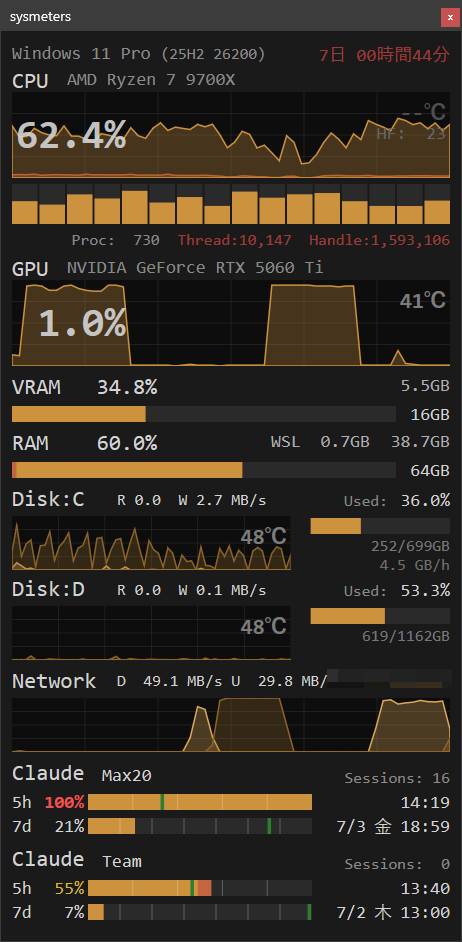
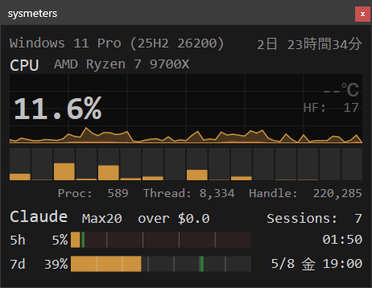
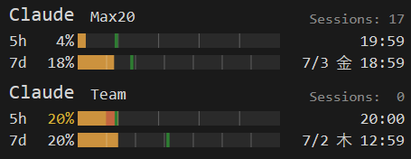

# sysmeters

Windows 11 用リアルタイムシステムリソース監視 HUD アプリケーション。

CPU、GPU、メモリ、ディスク I/O、ネットワーク通信量に加え、  
**Claude Code のレートリミット使用状況をコンパクトなオーバーレイ GUI でモニタリングする。**



タスクトレイアイコンの右クリックメニュー「表示項目」から、CPU、GPU、メモリ、ディスク、ネットワーク、Claude の各セクションを個別にオン/オフできる。ディスクはさらにドライブ単位でも表示を切り替えられる。必要なカテゴリのみを残してウィンドウを最小化する用途にも対応する。下図は CPU と Claude のみを表示した例だ。



サブアカウントを有効化すると、Claude セクションがメイン / サブの 2 アカウント分縦に並んで同時表示される。下図はメイン / サブの 2 アカウント表示例だ。5h / 7d バー上の濃色は直近 N 分間で増えた使用率を示し、消費ペースを可視化する。



各種警告閾値を超えたタイミングで Toast 通知が表示される。通知の ON/OFF はシステムトレイアイコンの右クリックメニューから切り替え可能。


## 機能

- **CPU**：全体使用率（面グラフ）+ ハードフォールト（重畳面グラフ）+ 論理コア別使用率（縦バー、実際の論理コア数分）+ 温度（横バー）+ システム統計（Proc/Thread/Handle、閾値超過で赤文字）
- **GPU**：使用率（面グラフ）+ 温度（横バー）、NVIDIA NVML 経由
- **RAM**：使用率（横バー）+ 使用量/総量
- **VRAM**：使用率（面グラフ）+ 使用量/総量、NVIDIA NVML 経由
- **Disk I/O**：起動時に実在する固定ドライブ（C: 以降レター順、最大 8 台）を自動検出しドライブ別に表示  
  Read/Write 分離（面グラフ + MB/s）、使用率（横バー）、使用量/総量、S.M.A.R.T. 書き込み量（GB/h）を表示する。Google ドライブ等 `DRIVE_FIXED` を名乗る仮想ドライブは物理ディスク実体の有無で除外する。タスクトレイの「表示項目」からドライブ別に表示 ON/OFF を切り替え可能で、非表示時も空き容量・S.M.A.R.T. 警告の監視は継続する。
- **Network**：全 NIC 合算、送信/受信分離（面グラフ + KB/s or MB/s）
- **IP**：グローバル IP アドレス表示（5 分ごとに取得、オフライン時は NO INTERNET📵）
- **Claude Code**：5h / 7d レートリミット使用率（横バー）+ リセット時刻、セッション数。メイン / サブの 2 アカウントを縦並びで同時表示できる（サブは `sysmeters.toml` の `[claude_sub] enable = true` と `config_dir` 指定で有効化）。横バー上の緑の縦線は均等消費ペースマーカー（リセットまでの残り時間で均等に消費した場合の理想消費位置）。5h / 7d バーには直近 N 分間で増えた使用率を濃色（RAM の WSL オーバーレイと同色）で重ね塗りし、消費ペースを視覚化する（`sysmeters.toml` の `[claude] delta_window_min` / `delta_window_7d_min`、デフォルト 5 分 / 720 分＝12 時間、0 で無効）。7d バーの直下には上位モデル（Fable 等）専用 7d 枠の消費率を示す朱色のミニバーを表示する（Usage API が専用枠を返すアカウントのみ。色は `sysmeters.toml` の `[color] claude_scoped_bar`、縦幅は `[claude] scoped_bar_px`、デフォルト 2px、0 で非表示）。専用枠が 100% に到達するとバーが警告色（`[color] claude_scoped_bar_warn`、デフォルト赤）に変わり、アカウント別に警告音・Toast 通知を発する（100% 未満へ戻るとリセット）。5h バーには PT 平日 5:00-10:59 を暗赤色で示すピーク時間帯表示があるが、2026-05 の Anthropic によるレート制限撤廃に伴いデフォルト OFF（`sysmeters.toml` の `[claude] show_peak_bar = true` で有効化可能）。毎時 0 分に最新データを強制取得する。セッション数はアカウントごとに分けてカウントする（`claude.exe` のコマンドラインから判別）。Sessions ラベルの左には直近の Usage API 取得時刻（`H:MM` 形式）を同色・同サイズで表示し、表示データの鮮度を確認できる。色による警告条件は後述の「Claude Code の警告条件」を参照
- **Claude Code 制限強化時間 通知**：ローカル平日 21:00 に Toast 通知を発する（PT 5:00 消費ピーク時間帯の開始予告）。起動時点でピーク期間内なら即時通知する。2026-05 のレート制限撤廃に伴いデフォルト OFF。ON/OFF・通知文言・警告音の有無は `sysmeters.toml` の `[notify]` セクションで調整可能
- **Claude Code nudge**：5h ウィンドウのリセット通過後にレートリミット消費が始まっていない間隙を検知したタイミング（起動直後を含む、ウィンドウごとに 1 回）で `claude.exe`（設定可能）を自動起動し、次のウィンドウでのレートリミット消費を促す機能。Usage 取得間隔も設定可能。`sysmeters.toml` の `[claude] nudge_enable = true`（メイン）/ `[claude_sub] nudge_enable = true`（サブ）でアカウント別に有効化。`nudge_cmd` は両アカウント共通で、サブ実行時は `CLAUDE_CONFIG_DIR` 環境変数に `claude_sub.config_dir` が一時設定された状態で起動される（Claude CLI に `--config-dir` コマンドオプションは存在せず、設定ディレクトリの上書きは環境変数経由のみ）。デフォルト OFF
- **更新確認**：起動時に GitHub の最新リリースを確認し、新版があれば Toast 通知とトレイメニューで知らせる。同一版への繰り返し通知はしない。`sysmeters.toml` の `[update] enabled = false` で無効化可能
- **警告音**：いずれかの監視項目が警告閾値を超えると `alert.wav` を再生。ヒステリシス付きで再開閾値を下回るまで再鳴動しない。BLE ヘッドフォン対策として前後に 19kHz 不可聴トーンを挿入
- **Toast 通知**：閾値超過時に OS のトースト通知を表示し、どの項目が超過したかを通知する

Direct2D による GPU アクセラレーション描画で滑らかな表示を実現。

### 警告色

各メトリクスが設定ファイルの閾値を超えると、該当するテキストやバーが赤色に変化する。温度は 3 段階（通常：グレー → 注意：オレンジ → 危険：赤）で色分けされる。警告色の判定は瞬間値に基づく。

### 警告音

いずれかの監視項目が閾値を超えると `alert.wav` を再生する。ヒステリシス機構により、リセット閾値を下回るまで同一項目の警告音は再鳴動しない。CPU と GPU の警告音は瞬間スパイクによる誤警告を防ぐため、直近数サンプルの平均値で判定する。

- BLE ヘッドフォンの省電力移行で冒頭が途切れる問題に対応し、再生前後に 19kHz 不可聴トーンを挿入。長さは `sysmeters.toml` の `[guard] tone_ms` で調整可能（0 で無効化）
- WASAPI 共有モードで再生するため、他のアプリケーションの音声と共存
- 閾値・リセット閾値・警告音の有効/無効は `sysmeters.toml` の `[threshold]` セクションで設定可能
- Toast 通知の有効/無効はタスクトレイアイコンの右クリックメニューで切り替え可能（設定はレジストリに保持）
- フルスクリーンアプリ（ゲーム・プレゼン等）の実行中は Toast 通知と警告音を自動抑制する。タスクトレイメニューの「フルスクリーン時は通知しない」で ON/OFF 切り替え可能（デフォルト ON）
- フルスクリーン抑制中でも通したい警告は、タスクトレイメニュー「常に警告通知を有効にする」で項目別（CPU 使用率 / CPU 温度 / GPU 使用率 / GPU 温度 / ディスク温度）に例外指定できる。ON の項目は抑制中でも Toast＋警告音を発する。デフォルトは温度系 3 項目が ON（設定はレジストリに保持。「フルスクリーン時は通知しない」が OFF の間はグレーアウト表示）
- フルスクリーン抑制が働いている間は、ウィンドウタイトルが `sysmeters (fullscreen:silent)` 表示になる
- タスクトレイの右クリックメニューから Windows スタートアップ登録の ON/OFF を切り替え可能

### Claude Code の警告条件

Claude Code セクションは条件が多いため、色ごとに分けて整理する。

#### パーセンテージ文字色

| 状態 | 条件 |
|---|---|
| 通常色 | 均等消費ペース位置（緑線）以下 |
| 黄 | 均等消費ペース位置（緑線）を超過 |
| 赤 | 使用率が 100% に到達、または均等消費ペース位置からの超過率が `claude_5h_pct` / `claude_7d_pct`（`sysmeters.toml` の `[threshold]`、デフォルト 20% / 7.14%）以上 |

黄・赤への変化はアカウント別に警告音・Toast 通知を伴う。（警告音のリセット閾値は `reset_claude_5h_pct` / `reset_claude_7d_pct`、デフォルト 0 = 理想ペース以下に戻ったら即リセット）
7d バーが警告中の間は、バー左端に警告解除までの残り時間を黒字で表示する。（60 分以内は `-20m` のように分単位、60 分超は `-1.1h` のように時間単位。塗り幅が文字表示に足りない低使用時は非表示）

#### 超過料金テキスト

プラン上限超過分を従量課金するアカウントでは、ヘッダ行に `over $X.X` を表示する。超過額が `claude_over`（`sysmeters.toml` の `[threshold]`、デフォルト $0 = 発生時点で即赤表示）を超えると赤文字になる。

#### バー背景色（使い切り不能検知）

7d バー専用の表示。直近の平均消費ペースのままでは目標使用率に届かない＝挽回不能と判断すると、7d バーの未使用部分の背景を暗青色（`sysmeters.toml` の `[color] claude_underuse_bg` で変更可能）に変える。表示のみで警告音・Toast は発しない。次の両方を満たしたときのみ発生する。（`[claude] underuse_enable = false` で機能自体を無効化できる）

- 7d ウィンドウ開始（リセット）から `delta_window_7d_min`（デフォルト 720 分＝12 時間）以上経過している
- 直近の実測平均消費ペースで残り時間を消費し続けても、予測到達率が `underuse_warn_pct`（デフォルト 98%）に届かない

ペースの基準点は約 `delta_window_7d_min` 分前のサンプルで、無い場合は最古サンプル（30 分以上経過時）、アプリ停止明けは停止前最後のサンプル（アンカー）で代用する。ペースが推定できない間（履歴の観測時間が 30 分に満たないとき、直近の増加がないとき）は判定しない。7d の履歴は `$TEMP` にファイル保存され、停止前最後のサンプルをアンカーとして最大で窓幅の 2 倍（デフォルト 24h）まで保持するため、sysmeters や OS を再起動しても停止前からの実質ペースで判定を継続できる。24h を超える停止後は履歴を作り直し、約 30 分で判定を再開する。

## インストール

[Scoop](https://scoop.sh/) でインストールできる。

```powershell
scoop bucket add aviscaerulea https://github.com/aviscaerulea/scoop-bucket
scoop install sysmeters
```

> [!TIP]
> 設定は `sysmeters.toml` を直接編集せず、同じディレクトリに `sysmeters.local.toml` を作り、デフォルトから変更する項目だけを記述するのがお勧めだ。バージョンアップで `sysmeters.toml` が更新されても設定内容を移行する手間がない。廃止された設定項目が `sysmeters.local.toml` に残っていても無視され、動作はデフォルトに従う。

## 実行

```
out\sysmeters.exe
```

タスクトレイ（通知領域）にアイコンが表示される。右クリックメニューで常に最前面・Toast 通知の切り替え、表示項目の選択、設定ファイルを開く、終了などの操作ができる。

## 設定

`sysmeters.toml` で外観（背景色、グラフ色）、警告閾値、プロセス優先度の自動制御等をカスタマイズできる。`sysmeters.local.toml` が存在する場合、その値が `sysmeters.toml` の設定を上書きする。個人設定はこちらに記述すると更新時の差分が出にくい。

サブアカウントを有効化する最小例。`config_dir` にはサブ用 `.claude/` ディレクトリの絶対パスを指定する。

```toml
[claude_sub]
enable     = true
config_dir = "C:\\Users\\xxx\\.claude-sub"
# name         = "Sub"     # 任意。ヘッダ表示名（省略時 "Claude"）
# nudge_enable = false     # 任意。nudge_cmd は [claude] と共通
```

## 動作要件

- Windows 11（64bit）
- CPU 温度を表示するには **PawnIO ドライバ** のインストールが必要（`winget install namazso.PawnIO`）

## ビルド

```powershell
# 依存ライブラリの取得（初回のみ）
pwsh.exe scripts/fetch-deps.ps1

# ビルド
task build

# リリースビルド（zip パッケージング）
task release
```
